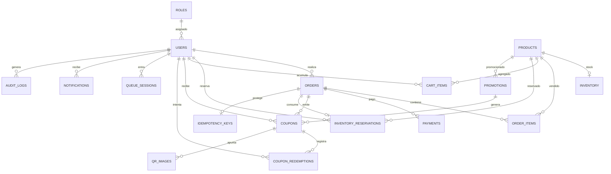

# Base de Datos — Módulo e-commerce GIT Week 2026

**Motor:** PostgreSQL 16 (Docker Compose)
**ORM:** Prisma 7 (generator `prisma-client`, driver adapter `@prisma/adapter-pg`)
**Ruta schema:** `backend/prisma/schema.prisma`
**Migraciones:** `backend/prisma/migrations/` (aditivas, nunca destructivas)
**Seed:** `backend/prisma/seed.ts` (roles, admin demo, 3 planes con inventario)

## Principios

1. **PostgreSQL es la fuente definitiva de verdad** para stock, órdenes, pagos, reservas y cupones. Redis nunca administra inventario.
2. **Anti-sobreventa por defensa en profundidad:**
   - Operaciones **atómicas** con guarda (`UPDATE ... WHERE available_stock >= qty`).
   - `CHECK` constraints en DB (ver migración `0001_init`):
     - `reserved_stock + sold_stock <= initial_stock`
     - `reserved_stock >= 0`, `sold_stock >= 0`, `available_stock >= 0`
     - `order_items.line_total = unit_price * quantity`
   - Columna `version` en `Inventory` para optimistic locking.
3. **Idempotencia:** tabla `idempotency_keys` para checkout, webhooks de pago y redención de cupones (evita órdenes duplicadas con doble clic de "Pagar").

## Entidades (ER)



## Modelos clave

| Modelo | FK / Relaciones | Índices y constraints relevantes |
|---|---|---|
| `Role` | — | `code` único |
| `User` | `roleId → Role` | `email` único |
| `Product` | — | `slug` único; planes: General S/39, Professional S/69, Executive S/99 |
| `Inventory` | `productId → Product` (1:1) | CHECK stock; `version` optimistic lock |
| `Promotion` | `productId → Product` (opcional) | `publicId` único; ventana fechas |
| `InventoryReservation` | `userId → User`, `productId → Product`, `order → Order` | índice `(status, expiresAt)` para liberación |
| `Order` | `userId`, `reservationId → InventoryReservation` | `publicId`, `idempotencyKey` únicos |
| `OrderItem` | `orderId`, `productId` | único `(orderId, productId)`; CHECK línea |
| `Payment` | `orderId` | únicos `(provider, providerTransactionId)`, `(provider, rawEventId)` |
| `Coupon` | `userId`, `promotionId`, `orderId` | `code`, `publicId` únicos |
| `CouponRedemption` | `couponId`, `userId` | log de intentos (anti doble canje) |
| `QrImage` | `couponId` | apunta a `/coupon/{publicId}` |
| `CartItem` | `userId` o `sessionKey`, `productId` | únicos `(userId, productId)` / `(sessionKey, productId)` |
| `QueueSession` | `userId` | estado WAITING/ADMITTED/EXPIRED/…; Redis administra posición |
| `IdempotencyKey` | `orderId` (1:1) | `key` único |
| `AuditLog` | `actorId` | `correlationId` para trazabilidad |
| `Notification` | `userId` | — |
| `Restriction` | — | único `(type, target)` para rate-limit/lockout |

## Migración inicial

`0001_init` crea el esquema completo + CHECK constraints (aditivo, sin `DROP`).

```bash
# Tras levantar los contenedores (postgres + redis):
docker compose up -d
cd backend
npx prisma migrate deploy   # aplica migraciones sinon
npx prisma db seed          # inserta roles + admin demo + planes
```

> En entornos nuevos puede usarse `npx prisma migrate dev` (crea y aplica). En producción **solo** `prisma migrate deploy`.

## Invariante de stock (flujo correcto)

```
Reservar:   UPDATE inventory SET reserved_stock=reserved_stock+?, available_stock=available_stock-?, version=version+1
            WHERE product_id=? AND available_stock >= ?        → 0 filas = rechazo (sin sobreventa)
Liberar:    UPDATE inventory SET reserved_stock=reserved_stock-?, available_stock=available_stock+?, version=version+1
            WHERE reservation ACTIVE → EXPIRED/CANCELLED (idempotente)
Vender:     UPDATE inventory SET sold_stock=sold_stock+?, reserved_stock=reserved_stock-?, version=version+1
            al convertir reserva en orden pagada
```

Nunca se hace `SELECT stock → validar en app → UPDATE` sin protección atómica.