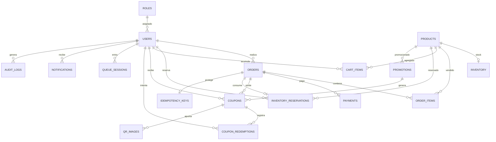

# Base de Datos — Módulo e-commerce GIT Week 2026

**Motor:** PostgreSQL 16 (Docker Compose)
**ORM:** Prisma 7 (generator `prisma-client`, driver adapter `@prisma/adapter-pg`)
**Ruta schema:** `backend/prisma/schema.prisma`
**Migraciones:** `backend/prisma/migrations/` (aditivas, nunca destructivas)
**Seed:** `backend/prisma/seed.ts` (roles, admin demo, 3 planes con inventario)

## Principios

1. **PostgreSQL es la fuente definitiva de verdad** para stock, órdenes, pagos, reservas y cupones. Redis nunca administra inventario.
2. **Anti-sobreventa por defensa en profundidad:**
   - Operaciones **atómicas** con guarda (`UPDATE ... WHERE available_stock >= qty`).
   - `CHECK` constraints en DB (ver migración `0001_init`):
     - `reserved_stock + sold_stock <= initial_stock`
     - `reserved_stock >= 0`, `sold_stock >= 0`, `available_stock >= 0`
     - `order_items.line_total = unit_price * quantity`
   - Columna `version` en `Inventory` para optimistic locking.
3. **Idempotencia:** tabla `idempotency_keys` para checkout, webhooks de pago y redención de cupones (evita órdenes duplicadas con doble clic de "Pagar").

## Entidades (ER)



## Modelos clave

| Modelo | FK / Relaciones | Índices y constraints relevantes |
|---|---|---|
| `Role` | — | `code` único |
| `User` | `roleId → Role` | `email` único |
| `Product` | — | `slug` único; planes: General S/39, Professional S/69, Executive S/99 |
| `Inventory` | `productId → Product` (1:1) | CHECK stock; `version` optimistic lock |
| `Promotion` | `productId → Product` (opcional) | `publicId` único; ventana fechas |
| `InventoryReservation` | `userId → User`, `productId → Product`, `order → Order` | índice `(status, expiresAt)` para liberación |
| `Order` | `userId`, `reservationId → InventoryReservation` | `publicId`, `idempotencyKey` únicos |
| `OrderItem` | `orderId`, `productId` | único `(orderId, productId)`; CHECK línea |
| `Payment` | `orderId` | únicos `(provider, providerTransactionId)`, `(provider, rawEventId)` |
| `Coupon` | `userId`, `promotionId`, `orderId` | `code`, `publicId` únicos |
| `CouponRedemption` | `couponId`, `userId` | log de intentos (anti doble canje) |
| `QrImage` | `couponId` | apunta a `/coupon/{publicId}` |
| `CartItem` | `userId` o `sessionKey`, `productId` | únicos `(userId, productId)` / `(sessionKey, productId)` |
| `QueueSession` | `userId` | estado WAITING/ADMITTED/EXPIRED/…; Redis administra posición |
| `IdempotencyKey` | `orderId` (1:1) | `key` único |
| `AuditLog` | `actorId` | `correlationId` para trazabilidad |
| `Notification` | `userId` | — |
| `Restriction` | — | único `(type, target)` para rate-limit/lockout |

## Migración inicial

`0001_init` crea el esquema completo + CHECK constraints (aditivo, sin `DROP`).

```bash
# Tras levantar los contenedores (postgres + redis):
docker compose up -d
cd backend
npx prisma migrate deploy   # aplica migraciones sinon
npx prisma db seed          # inserta roles + admin demo + planes
```

> En entornos nuevos puede usarse `npx prisma migrate dev` (crea y aplica). En producción **solo** `prisma migrate deploy`.

## Invariante de stock (flujo correcto)

```
Reservar:   UPDATE inventory SET reserved_stock=reserved_stock+?, available_stock=available_stock-?, version=version+1
            WHERE product_id=? AND available_stock >= ?        → 0 filas = rechazo (sin sobreventa)
Liberar:    UPDATE inventory SET reserved_stock=reserved_stock-?, available_stock=available_stock+?, version=version+1
            WHERE reservation ACTIVE → EXPIRED/CANCELLED (idempotente)
Vender:     UPDATE inventory SET sold_stock=sold_stock+?, reserved_stock=reserved_stock-?, version=version+1
            al convertir reserva en orden pagada
```

Nunca se hace `SELECT stock → validar en app → UPDATE` sin protección atómica.

## Fase 5 — Órdenes (checkout atómico con idempotencia)

`OrderService` (`backend/src/orders/order.service.ts`) crea una orden a partir de una reserva temporal **ACTIVE** del mismo usuario, todo en una transacción:

1. `SELECT ... FOR UPDATE` sobre la reserva → impide doble consumo concurrente de la misma reserva.
2. Valida pertenencia (`userId`), estado `ACTIVE` y que no exista otra orden usando esa reserva.
3. Toma **snapshot de precios** del producto al momento del checkout (la reserva ya congeló la cantidad).
4. Crea `Order` (`PAYMENT_PENDING`) + `OrderItem` + fila de `IdempotencyKey` (`USED`).

Garantías:

- **Idempotencia:** ante la misma `idempotencyKey`, se devuelve la orden existente (sin duplicar). Bajo concurrencia, la violación de unicidad se resuelve re-gestionando la orden ganadora.
- **La reserva permanece `ACTIVE`** hasta que el pago se confirme (Fase 6): ahí se convierte en `CONVERTED` mediante `ReservationService.convert` y el stock pasa de reservado a vendido.
- Endpoints: `GET /orders/:publicId` (consulta). La creación se expondrá en la fase de IAM/autenticación (hoy ocurre en transacciones del dominio).

Verificación: `backend/test/orders.int-spec.ts` (creación, snapshot de precios, replay idempotente, reserva ajena, reserva cancelada y doble consumo).

## Fase 6 — Pagos

`PaymentService` (`backend/src/payments/payment.service.ts`) orquesta el ciclo de vida del pago sobre la orden en `PAYMENT_PENDING`:

- **`createForOrder(orderPublicId, provider?)`**: crea (o reutiliza) el pago `PENDING` por el total de la orden. En sandbox, el `providerTransactionId` es una referencia local generada al momento de crear el pago (reemplaza la llamada real al proveedor).
- **`confirmPayment(event)`** (entrada de webhook): idempotente por `rawEventId`.
  1. Solo el primer evento que pasa la guarda (`PENDING`/`FAILED` → terminal) ejecuta los efectos.
  2. Si `success` y el monto coincide → pago `PAID`, orden `PAID` (+ `paidAt`) y la reserva pasa a `CONVERTED` mediante `ReservationService.convert` → stock `reserved → sold`. Los replays del mismo evento no tocan stock ni orden.
  3. Si `success: false` → pago `FAILED`, la orden queda `PAYMENT_PENDING` (reintentable) y la reserva sigue `ACTIVE`.
- El provider se configura con `PAYMENT_PROVIDER` (`.env.example`, placeholder sandbox). Proveedores reales (CULQI, MERCADO_PAGO, STRIPE, NIUBIZ) se conectan vía adaptadores.
- Defensa extra: rechazo si `amountCents` del evento no coincide con el esperado.
- Endpoints: `GET /payments/:publicId`. La creación/confirmación quedan en el dominio (checkout/webhook) y se expondrán con la fase de IAM/autenticación.

Verificación: `backend/test/payments.int-spec.ts` (creación/reuso, confirmación feliz con stock, replay idempotente, fallo con reintento, orden ya pagada, monto inválido y transacción desconocida).

## Fase 10 — Carrito (adelantada)

`CartService` (`backend/src/cart/cart.service.ts`) gestiona el carrito **sin reservar inventario**: la reserva comienza al entrar al checkout (Fase 4), el precio se toma del producto al consultar y se congela en la orden (Fase 5). El carrito no es la autoridad de stock.

- **Identidad exacta:** `userId` (sesión autenticada futura) **o** `sessionKey` (invitado), nunca ambos/ninguno (`BadRequest`). Un solo item por producto gracias a los unique `(userId, productId)` / `(sessionKey, productId)`.
- `add` valida que el producto exista y esté `ACTIVE` (`NotFound`/`Conflict`), luego `upsert` con `quantity incremented` (acumula si ya está).
- `setQuantity` fija cantidad ≥ 1 con `updateMany` guardado (0 filas → `NotFound`); `remove`/`clear` son idempotentes (`deleteMany`).
- `list` devuelve items con `pegado product` y `subtotalCents`.
- Endpoints (invitado): `GET /cart/session/:sessionKey`, `POST /cart/session/:sessionKey/items`, `PATCH /cart/session/:sessionKey/items/:productId`, `DELETE .../items/:productId`, `DELETE /cart/session/:sessionKey`. Autenticado (`/cart/user/:userId`) llega con la fase IAM.
- DTOs con `class-validator` (`IsInt`, `Min`) + `ValidationPipe` global (`whitelist`, `forbidNonWhitelisted`, `transform`).

Verificación: `backend/test/cart.int-spec.ts` (acumulación, carritos separados, set/remove/clear, item inexistente, producto no activo, identidad inválida) y `backend/test/cart.e2e-spec.ts` (flujo HTTP + validación 400).

## Fase 7 — Cupones (códigos de descuento)

Requerimiento funcional: **URPxGIT, UTPxGIT, UNABxGIT** descuentan **S/5 (500 centavos)** al aplicarse en checkout. Los códigos son **case-sensitive** (el `x` es minúscula).

Cambios de schema (aditivos):

- Migración `0002_promotion_discount_code`: columna `Promotion.code` (única, la columna código público de cada promoción).
- Migración `0003_order_discount_code`: columna `Order.discountCode` (cupón aplicado, para idempotencia del descuento).
- Seed: 3 `Promotion` activas, `FIXED_AMOUNT=500`, ventana 2 años, `maxRedemptions=null` (sin límite), sobre los modelos existentes.

`CouponService` (`backend/src/coupons/coupon.service.ts`):

- `listActive()` → códigos vigentes; `checkCode(code)` → valida un código (read-only, `NotFound` si no existe, `Conflict` si no está activo o fuera de ventana).
- `apply({ userId, orderPublicId, code })`: requiere orden del usuario en `PAYMENT_PENDING` (`Forbidden`/`Conflict`). En **una transacción**:
  1. Guarda atómica de capacidad: `UPDATE promotions ... WHERE usedRedemptions < maxRedemptions` (si aplica), `usedRedemptions+1`. 0 filas → `Conflict` "agotado".
  2. Guarda atómica sobre la orden: `UPDATE orders SET discountCents=?, discountCode=?, totalCents=? WHERE discountCents=0 AND status='PAYMENT_PENDING'`. 0 filas → `Conflict`.
  3. `discountCents = min(subtotal, value)` (descuento > subtotal se topa en 0 total).
- **Replay idempotente:** mismo código sobre la misma orden devuelve el estado actual (`replay: true`) sin reincrementar capacidad. Un segundo código distinto → `Conflict` ("ya existe descuento").
- El pago posterior (`PaymentService.createForOrder`) usa `totalCents` ya descontado.
- Endpoints (lecturas públicas pre-auth): `GET /coupons`, `GET /coupons/:code`. `apply` queda a nivel de servicio hasta la fase IAM. (El documento listaba `POST /coupons/validate`; se expone como `GET /coupons/:code` por ser read-only.)

Pendiente dentro de la fase (requiere checkout HTTP + IAM): emitir el **cupón físico al confirmarse el pago** — `Coupon` con `code` único tipo `PROMO-2026-XXXXXX`, `status AVAILABLE`, y `QrImage` apuntando a `/coupon/{publicId}` (sin datos sensibles). Y la **Fase 8 (Redemption)** anti doble canje transaccional con `CouponRedemption`.

Verificación: `backend/test/coupons.int-spec.ts` (descuento aplicado, replay, segundo código rechazado, código inexistente, estado no `PAYMENT_PENDING`, orden ajena, tope en 0, listado/validación, pago con total descontado, capacidad agotada).